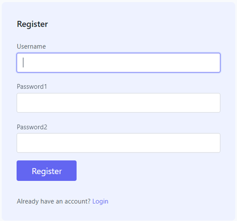
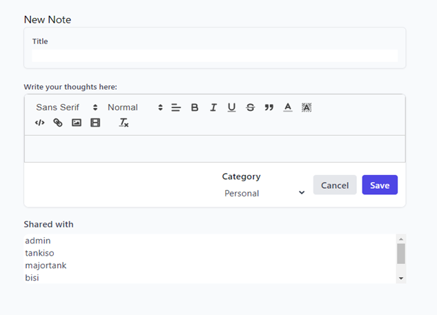
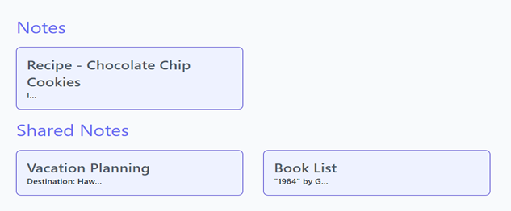
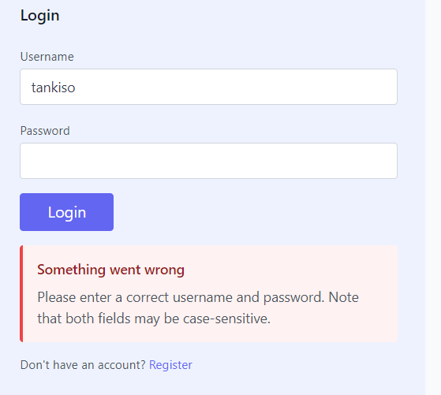

# SmartNotes

Creation and management of simple notes by Thabo Tankiso Thebe.

[Access SmartNotes here](https://legendary-space-guacamole-q9r55wr954wcxr9j-8000.app.github.dev)

## Contents
1. [Document Version History](#document-version-history)
2. [Signed Off By](#signed-off-by)
3. [Contributors](#contributors)
4. [Current Features Analysis](#current-features-analysis)
5. [High-level Description](#high-level-description)
6. [Systems Involved](#systems-involved)
7. [Process Flow](#process-flow)
8. [Detailed Steps](#detailed-steps)
    1. [User logs into the application](#1-user-logs-into-the-application)
    2. [User register for SmartNotes account](#2-user-register-for-smartnotes-account)
    3. [Login into SmartNotes](#3-login-into-smartnotes)
    4. [Create a note](#4-create-a-note)
    5. [Read a note](#5-read-a-note)
    6. [Update a note](#6-update-a-note)
    7. [Delete a note](#7-delete-a-note)
9. [Possible Exceptions](#possible-exceptions)

---

### Confidential 

## Document Version History

| Version | Author        | Date       |
| ------- | ------------- | ---------- |
| 1.x     | Tankiso Thebe | 02/05/2024 |

## Signed Off By

Name | Function | Responsibility

## Contributors

| Name          | Function          | Responsibility       |
| ------------- | ----------------- | --------------------- |
| Tankiso Thebe | Software Developer | Develop |
| Lebohang Thokoane | Quality Assurance | Test the app |

## Current Features Analysis

### High-level Description

The application allows different users to create, read, and manage notes. Admin users have additional capabilities to manage user accounts and notes. Currently, normal users can:

- Register for SmartNotes account.
- Login into SmartNotes.
- Create a note.
- Read a note.
- Update a note.
- Delete a note.
- Share a note.

### Systems Involved

| System       | Used for                           | User role needed |
| ------------ | ---------------------------------- | ---------------- |
| Django Admin | Manage the SmartNotes application users and notes | Admin access     |
| Notes        | Displaying and managing notes for logged-in users | User account (username and password) |
| Home      | Main or landing page for the app | Any |

### Process Flow

Here is a description of the process in the form of a flow chart:
```mermaid
graph LR
A[Register] --> B[Login] --> C[Create/Share a note] 
B --> D[Read a Note]
B --> E[Update a Note/Share a note]
B --> F[Delete a Note]
```
### Detailed Steps

#### 1. User logs into the application

- The URL used by the user is: `http://smartnotes.local:8000/`

#### 2. User register for SmartNotes account

- The URL used by the user is: `http://smartnotes.local:8000/register`

- User can create personal credentials (a username and a password).

#### 3. Login into SmartNotes

- The URL used by the user is: `http://smartnotes.local:8000/login`

- User enters their personal credentials (a username and a password).

#### 4. Create a note

- After logging into the site, the user inserts a title, content and category for the note.

- A User can choose to share a note with other users of their choice or not share.
- User saves the note.

#### 5. List/Read a note

- After creating or if another user shares a note, the user can see their note listed under "Notes" or "Shared Notes".
- User can read/see their notes by clicking on the note's title.

#### 6. Update a note

- After creating a note, the user can edit their note and update it.
- While editing the user can also choose to share the note with other users.

#### 7. Delete a note

- After creating a note, the user can delete it.

## Possible Exceptions

Exceptions are special cases and rules that can influence and even stop the smooth running of the SmartNotes app.

### Logic Exceptions

- **Missing Data**: Username, password, note title, and notes content are all required. If some of this information is missing, the user will not be able to login or create a note.

### System Exceptions

- **Invalid Credentials**: If the user provides invalid credentials, the login is not successful, and the process stops.

